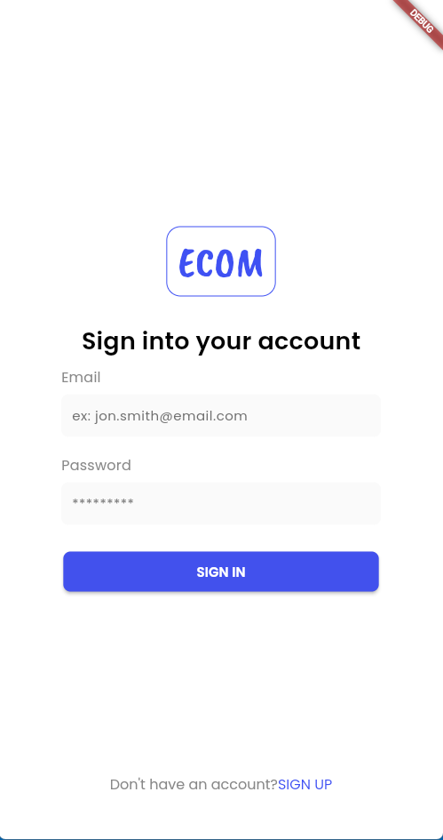
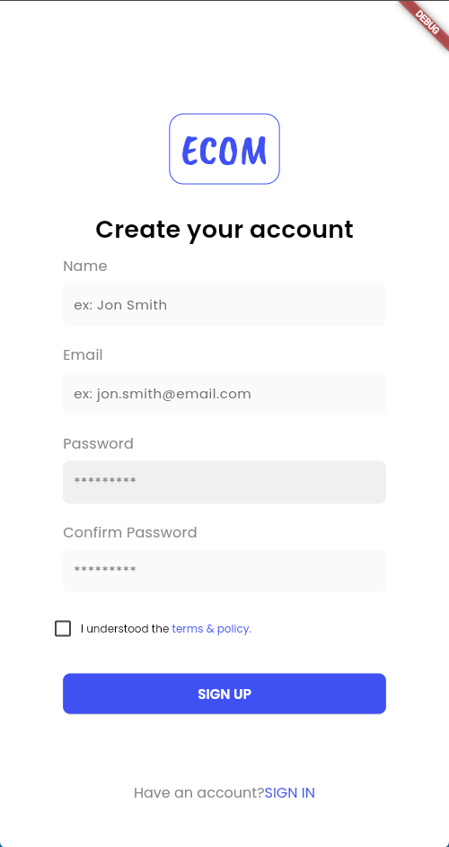
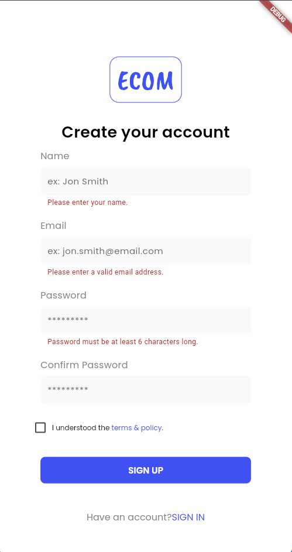

# chat_app

A Flutter project implementing a chat application with authentication.

## Features

- **User Authentication:** Secure login and registration screens.
- **Home Page:** Currently serves as a verification page for successful login. Will be updated with chat features in future releases.
- **Modern UI:** Clean and intuitive user interface for authentication flows.

## Screenshots

>### splash screen

>### Login Page

>### Signup Page

>### Validation Errors


## Usage

1. **Clone the repository:**
   ```sh
   git clone https://github.com/ayanasamuel8/2025-A2SV-G6-mobile-assessment.git
   cd chat_app
   ```

2. **Install dependencies:**
   ```sh
   flutter pub get
   ```

3. **Run the app:**
   ```sh
   flutter run
   ```

4. **Authentication Flow:**
   - Launch the app.
   - Register a new account or log in with existing credentials.
   - Upon successful authentication, you are redirected to the Home Page, which currently verifies login status.
   - The Home Page will be enhanced with chat features in upcoming updates.

## Technical Overview

### Authentication

- **State Management:** [Provider](https://pub.dev/packages/provider) is used for managing authentication state.
- **Validation:** Form validation is implemented for email and password fields.
- **Navigation:** Uses Flutter's Navigator for routing between login, registration, and home screens.

### UI

- **Responsive Design:** Adapts to different screen sizes.
- **Material Design:** Follows Flutter’s Material guidelines for consistency and accessibility.

### Home Page

- **Current Purpose:** Acts as a placeholder to confirm successful authentication.
- **Future Plans:** Will display chat rooms, recent messages, and allow navigation to individual chats.

## Roadmap

- [x] Authentication (Login/Registration)
- [ ] Chat functionality (coming soon)
- [ ] User profiles
- [ ] Real-time messaging

## Contributing

Contributions are welcome! Please open issues or submit pull requests for improvements.

## License

This project is licensed under the MIT License.
